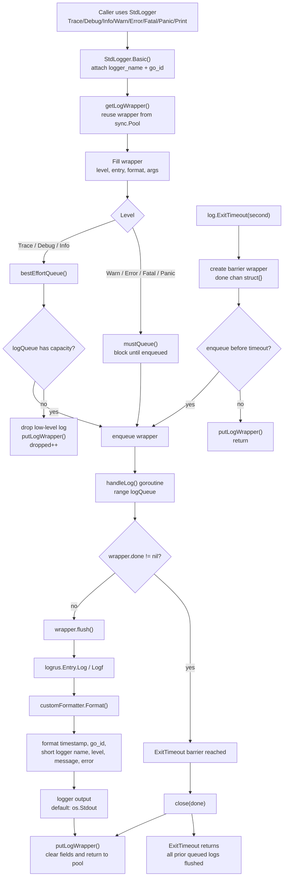
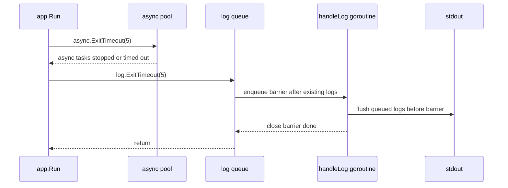

# log package flow

## Exit sequence

## Guarantees

- `ExitTimeout` waits for logs already accepted into `logQueue` before the barrier.
- `ExitTimeout` does not close `logQueue`, so later log calls will not panic because of a closed channel.
- `Trace`, `Debug`, and `Info` are best effort and may be dropped when the queue is full.
- `Warn`, `Error`, `Fatal`, and `Panic` block until they are accepted into the queue.
