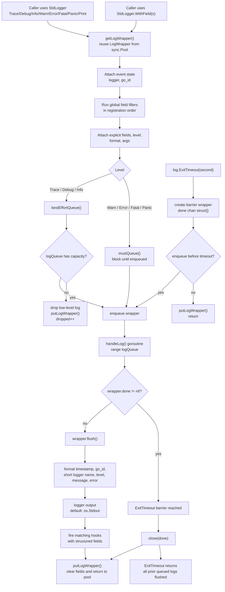
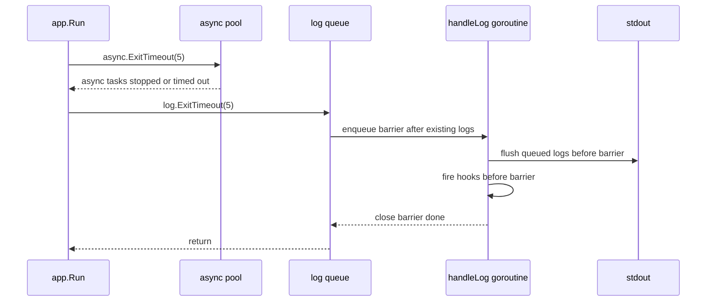

# log package flow

## Exit sequence

## Guarantees

- `ExitTimeout` waits for logs already accepted into `logQueue` before the barrier.
- `ExitTimeout` does not close `logQueue`, so later log calls will not panic because of a closed channel.
- `Trace`, `Debug`, and `Info` are best effort and may be dropped when the queue is full.
- `Warn`, `Error`, `Fatal`, and `Panic` block until they are accepted into the queue.
- Hooks run in the log worker after console output, so accepted logs and their hooks before the barrier complete before `ExitTimeout` returns.
- Structured fields are delivered to hooks and are not rendered in console output.
- Global field fillers run in `StdLogger.wrapper()` before explicit `WithField(s)`, so explicit fields override same-key global fields.
- Multiple global field fillers are supported and run in registration order; later fillers win on same-key writes.
